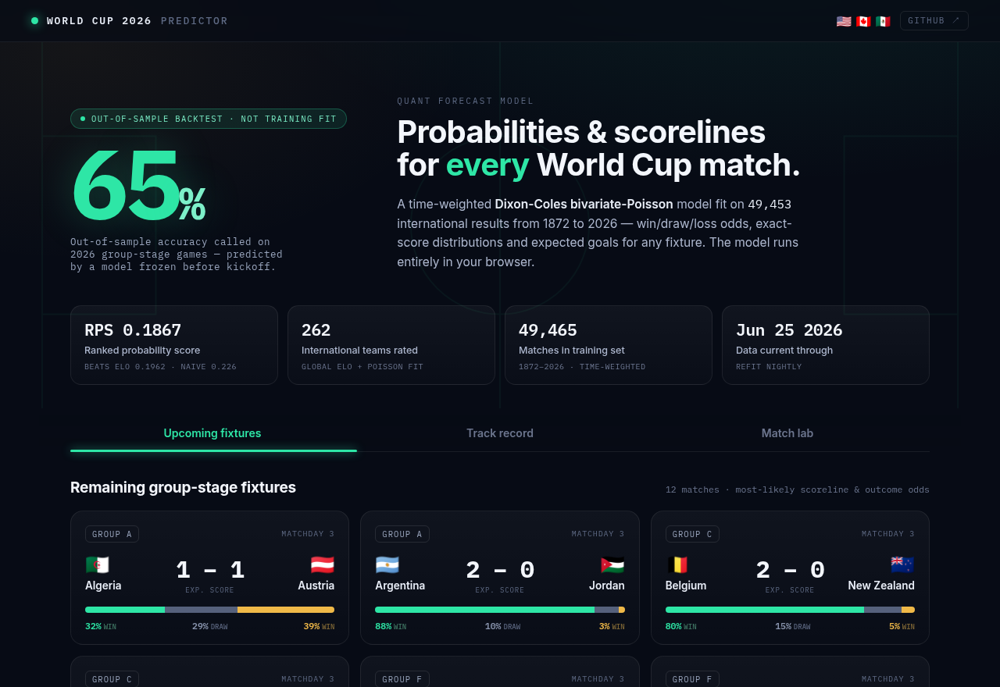

# World Cup 2026 Predictor

**[🏆 Live dashboard](https://nathanaelhub.github.io/worldcup-2026-predictor/)**



> **The tournament is over.** Spain beat Argentina 1-0 in the final on July 19,
> 2026. See **[Post-tournament retrospective](#post-tournament-retrospective)**
> for the honest final numbers — the sections below describe the system as it
> ran *during* the tournament.

A quant-style match predictor for the 2026 FIFA World Cup. It outputs **win /
draw / loss probabilities and a full score distribution** for any fixture, is
scored with a **proper scoring rule** (Ranked Probability Score), and is
benchmarked against an Elo model and the naive base rate. Through the
tournament, the dashboard predicted the upcoming group-stage fixtures and kept
an honest, **out-of-sample track record** against the games already played.

The hosted dashboard is **fully static** — the Dixon-Coles model is just a table
of coefficients, so prediction runs entirely in your browser (`static/js/model.js`,
a faithful port of the Python model). A GitHub Action refit on fresh data and
redeployed **daily** through the tournament, so the predictions stayed current.

> **It worked.** The data pipeline, time-weighted Dixon-Coles model, backtest,
> tournament Monte Carlo, and dashboard all ran end to end through a full World
> Cup. Final out-of-sample record: **103 matches, RPS 0.150 vs Elo's 0.166 and
> a naive base rate's 0.228, 70% outcome accuracy** — beating both baselines in
> every phase (group stage and knockouts). A leakage-safe pre-match **feature
> layer** (`wc2026/features.py`) was built and validated; blending a feature
> model into the Dixon-Coles core (`model.py`) never shipped — see
> **[`docs/PLAN.md`](docs/PLAN.md)**.

The model also simulates the remaining bracket **20,000 times** on every refit
(`models/simulation.json`): each nation's chance of reaching every round and
lifting the trophy, with real results locked in as they happen. Extra time is a
30-minute Poisson; unresolved ties go to a penalty coin-flip.

## The model

Each nation gets a latent **attack** and **defense** strength, fit by
**time-weighted Poisson regression** (exponential half-life so recent form
dominates) with a home-advantage term and the **Dixon-Coles low-score
correlation** ρ estimated by maximum likelihood:

```
log λ_home = μ + home_adv·(not neutral) + attack_home − defense_away
log λ_away = μ                          + attack_away − defense_home
```

The fitted λ's give the full `P(home=i, away=j)` score matrix, from which every
market (1X2, correct score, over/under, both-teams-to-score) follows.

## Backtest (out-of-sample, RPS — lower is better)

Each window refits using only matches *before* the tournament, then predicts it.

| Tournament | Matches | Model | Elo | Naive | Outcome acc |
|---|---|:---:|:---:|:---:|:---:|
| World Cup 2022 | 64 | **0.214** | 0.216 | 0.236 | 53% |
| World Cup 2026 (group stage) | 72 | **0.149** | 0.168 | 0.222 | **64%** |
| **Pooled** | 136 | **0.180** | 0.190 | 0.228 | 59% |

The model beats both baselines on RPS in every window. (Numbers regenerate into
`models/metrics.json` whenever you retrain.) This table is the **group-stage**
backtest only, using a single pre-tournament fit — see the
**[post-tournament retrospective](#post-tournament-retrospective)** below for
the knockout-stage numbers (a stricter, per-round walk-forward) and the full
tournament's combined record.

## Stack

- **Python 3.12** — pandas / NumPy / SciPy / **statsmodels** (the Poisson GLM)
- **Modeling** — time-weighted Dixon-Coles bivariate Poisson + from-scratch Elo
- **Flask** — dashboard API + vanilla-JS frontend
- **Data** — [martj42 international results](https://github.com/martj42/international_results)
  (~49k matches, no auth) + penalty-shootout history
- **Frontend** — vanilla JS; the model runs client-side (`static/js/model.js`)
- **Deploy** — GitHub Pages (static, auto-refreshed daily via Actions); also runs
  as a Flask app locally / on Render (`render.yaml`)

## Run

```bash
cd worldcup-2026-predictor
python -m venv .venv && source .venv/bin/activate   # Windows: .venv\Scripts\activate
pip install -r requirements.txt

python data/ingest.py     # pull results + shootouts -> data/matches.parquet
python scripts/train.py   # fit model, backtest, write models/*.json   (~30s)
python app.py             # -> http://localhost:8000
```

Unit tests for the model core (score matrix, DC correction, markets,
persistence): `pip install -r requirements-dev.txt && python -m pytest`.

The dashboard has four tabs:
- **Predicted** — the model's path to the final: it advances the favourite
  through every *unplayed* knockout tie and crowns a predicted champion, using
  the real result wherever a match has already finished.
- **Live** — the real bracket. Actual results as they land in the dataset;
  deeper slots stay TBD until both feeders finish. The R32 draw comes from the
  official bracket ([Wikipedia](https://en.wikipedia.org/wiki/2026_FIFA_World_Cup_knockout_stage))
  in bracket order, and every later round auto-advances the real winners — so the
  whole thing stays current with a nightly refit, no manual updates.
- **Track record** — games already played, scored by the *pre-tournament* model
  (a fair out-of-sample test) vs the actual result, with a running hit rate
- **Match lab** — pick any two nations for a full forecast

Tabs are deep-linkable (`/#live`, `/#lab`, …).

## Project structure

```
worldcup-2026-predictor/
├── app.py                 # Flask dashboard API
├── data/ingest.py         # public CSV sources -> data/matches.parquet
├── wc2026/
│   ├── dixon_coles.py     # time-weighted Dixon-Coles model        [implemented]
│   ├── ratings.py         # Elo team strength + fallback           [implemented]
│   ├── fixtures.py        # group reconstruction, upcoming + R32    [implemented]
│   ├── backtest.py        # walk-forward RPS vs baselines          [implemented]
│   ├── simulate.py        # tournament Monte Carlo (title odds)    [implemented]
│   ├── features.py        # leakage-safe pre-match features        [implemented]
│   └── model.py           # GBM feature blend                      [roadmap]
├── scripts/train.py       # fit + backtest + write models/*.json
├── scripts/retrospective.py # post-tournament knockout backtest + odds trajectory
├── models/                # committed artifacts so the app runs out of the box
├── static/                # vanilla-JS dashboard
├── docs/PLAN.md           # full quant strategy
├── docs/RETROSPECTIVE.md  # post-tournament writeup (full detail)
└── render.yaml
```

## Post-tournament retrospective

**Spain won the 2026 World Cup**, beating Argentina 1-0 in the final on July
19. Full writeup with a chart and the day-by-day title-odds table:
**[`docs/RETROSPECTIVE.md`](docs/RETROSPECTIVE.md)**. The short version:

- **Out-of-sample record, whole tournament:** 103 matches (72 group-stage +
  31 knockout, walk-forward per round), **RPS 0.150 (model) vs 0.166 (Elo) vs
  0.228 (naive)**, **70% outcome accuracy**. The model beat both baselines in
  every phase.
- **The favourite didn't win — at first.** Going into the knockouts the
  model's title favourite was Argentina (23.2%), not the eventual champion
  Spain (13.2%, second place). Argentina reached the final and lost. But from
  the Round of 16 on, the day-by-day refits favoured Spain in 8 of 12
  snapshots — and in every one from the quarter-finals onward except a single
  one-day blip for France.
- **Calibration:** Spain's simulated title probability sat at a flat ~13-14%
  for three-quarters of the tournament, then climbed through the knockouts to
  **52% on the eve of the final** (Argentina: 48%) — a genuine coin-flip read
  for a match that was, in fact, decided by one goal. Reasonable at the sharp
  end; a 13% number that turns out to be the winner is exactly what "13%"
  should mean, not a miscalibration.
- Reproduce it: `python scripts/train.py && python scripts/retrospective.py`.

## Honesty notes

Every headline number is from an **out-of-sample backtest** shown next to its
baselines — never the training fit. The track-record tab specifically uses a model
trained *before* those matches. **Not** modeled: injuries, red cards, and
in-tournament squad changes. Groups are *reconstructed* from played fixtures, so
group letters are inferred, not official.
