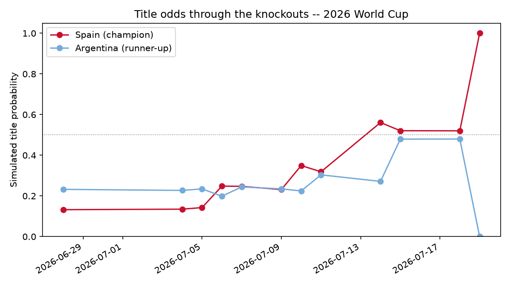

# Post-tournament retrospective

Spain beat Argentina **1-0** in the final on **July 19, 2026**. The tournament is
complete in `data/matches.parquet` (upstream `martj42/international_results`
caught up on its own — no manual `data/knockout_overrides.json` entries were
needed for the quarter-finals, semis, or final). Everything below is
regenerated by `python scripts/retrospective.py` (knockout walk-forward +
favourite trajectory) on top of `python scripts/train.py` (group-stage
backtest, from `models/metrics.json`), and both are checked against
`static/data/odds_history.json`, the day-by-day title-odds snapshots the site
accumulated over the tournament.

## 1. Knockout-stage accuracy & RPS

The group-stage backtest in `wc2026/backtest.py` uses a **single pre-tournament
fit** — legitimate there because the round-robin schedule is fixed before a
ball is kicked. The knockout bracket doesn't work that way: nobody knows the
quarter-final matchups until the round of 16 is played. So
`scripts/retrospective.py` runs a **stricter walk-forward** — refitting the
Dixon-Coles model and the Elo baseline once per match date, on everything
known strictly before it — over all 31 real knockout ties (Round of 32 through
the Final, reconstructed the same way `wc2026/fixtures.py` builds the "Live"
bracket tab; the third-place playoff isn't part of that bracket and isn't
included).

| Stage | Matches | Model RPS | Elo RPS | Naive RPS | Outcome acc |
|---|---:|:---:|:---:|:---:|:---:|
| Knockouts (R32 → Final, walk-forward) | 31 | **0.153** | 0.163 | 0.242 | **84%** |
| Group stage (single pre-tournament fit) | 72 | **0.149** | 0.168 | 0.222 | 64% |
| **Combined out-of-sample record** | **103** | **0.150** | **0.166** | **0.228** | **70%** |

The model beat both baselines in both phases. Outcome accuracy jumps sharply
in the knockouts (84% vs. 64% in the group stage) — expected, since knockout
matches are between the vetted survivors of a group stage, so Elo and form
gaps are wider on average. That gap holds despite the outcome space still
including draws: four knockout ties were level in the recorded score and went
to penalties — Germany–Paraguay, Netherlands–Morocco, Australia–Egypt, and
Switzerland–Colombia. Those are scored as draws for RPS, consistent with how
the rest of the project treats the recorded score (the model forecasts the
90-minute market; the penalty shootout itself is only modeled as a
coin-flip-ish resolver inside `wc2026/simulate.py`'s Monte Carlo, not as a
separate RPS outcome here).

## 2. Did the favourite win?

**No, not at first.** Before the knockouts started (2026-06-28 snapshot),
the model's title favourite was **Argentina at 23.2%** — Spain was second at
13.2%. Argentina reached the final and lost; the pre-knockout favourite did
not win the tournament.

But the day-by-day refits (`static/data/odds_history.json`, one snapshot per
deploy) tell a better story once real results start feeding back in:

| Date | Favourite | Prob | Spain | Argentina | Champion favoured? |
|---|---|---:|---:|---:|:---:|
| 2026-06-28 (pre-R32) | Argentina | 23.2% | 13.2% | 23.2% | ✗ |
| 2026-07-04 (R32 done) | Argentina | 22.7% | 13.5% | 22.7% | ✗ |
| 2026-07-05 | Argentina | 23.5% | 14.3% | 23.5% | ✗ |
| 2026-07-06 (R16 rolling in) | **Spain** | 24.8% | 24.8% | 19.9% | ✓ |
| 2026-07-07 (R16 done) | **Spain** | 24.7% | 24.7% | 24.4% | ✓ |
| 2026-07-09 (QF rolling in) | France | 25.4% | 23.1% | 23.5% | ✗ |
| 2026-07-10 | **Spain** | 34.9% | 34.9% | 22.4% | ✓ |
| 2026-07-11 (QF done) | **Spain** | 31.9% | 31.9% | 30.4% | ✓ |
| 2026-07-14 (SF: Spain through) | **Spain** | 56.1% | 56.1% | 27.1% | ✓ |
| 2026-07-15 (SF done) | **Spain** | 52.1% | 52.1% | 47.9% | ✓ |
| 2026-07-18 (eve of final) | **Spain** | 52.0% | 52.0% | 48.0% | ✓ |
| 2026-07-19 (final result) | **Spain** | 100% | 100% | 0% | ✓ |

The model favoured the eventual champion in **8 of 12** refits, and in
**every** refit from the quarter-finals on except one single-day blip (France
briefly led at 25.4% on 2026-07-09, right after France's 2-0 quarter-final
win over Morocco, before Spain's own quarter-final result the next day put
Spain back in front). So: wrong at the start, right for the entire back half
of the tournament — the model tracked the real signal (Spain's knockout
results) faster than it clung to its pre-tournament read on Argentina.

## 3. Calibration of the title odds

The chart above is the honest version of the story: Spain's title probability
was a flat, unremarkable ~13-14% through the group stage and Round of 32 —
third or fourth in the pack, well behind Argentina. It didn't cross Argentina
until the Round of 16 (2026-07-06), climbed through the quarters and semis,
and sat at **52% on the eve of the final** against Argentina's 48% — a real
coin-flip read for a final that was, in fact, decided by a single goal. That's
a good sign for calibration at the sharp end: the model didn't overstate its
confidence in Spain going into a genuinely close match, and it also didn't
hedge so much that it lost the plot when Spain, in fact, won.

The honest complaint is about the front end, not the back end: a model that
puts the winner at 13% for three-quarters of the tournament isn't "calibrated"
in any useful sense that early — it's just one plausible outcome among many,
which is what 13% is supposed to mean. Argentina's 23% pre-knockout probability
also wasn't a bad number in hindsight (Argentina made the final), so the
model's early-tournament spread across several plausible champions
(Argentina, France, England, Brazil, Spain, Portugal, Colombia all had between
6% and 23%) reads as reasonable uncertainty rather than a miscalibrated
overconfidence problem. The one number that stands out as arguably too
confident is Spain's **56.1%** on 2026-07-14, right after the France
semi-final win — a full round before the final was played, off a sample of
one commanding semi-final performance (Spain 2-0 France).

## 4. Overall out-of-sample record

Combining the group-stage (single pre-tournament fit, 72 matches) and
knockout (per-round walk-forward, 31 matches) evaluations — different
methodologies, but disjoint match sets, so pooling them is safe — the model's
full 2026 World Cup out-of-sample record is:

**103 matches | RPS 0.150 (model) vs 0.166 (Elo) vs 0.228 (naive) | 70%
outcome accuracy.**

The model beat the Elo baseline and the naive base rate in every phase of the
tournament it was tested against — group stage, knockouts, and pooled. It also
matches the pattern from World Cup 2022 (RPS 0.214 vs Elo 0.216 vs naive
0.236): a consistent, modest-but-real edge over a strength-only Elo baseline,
not a dramatic one. No claim is made here against a real bookmaker closing
line — that comparison (`docs/PLAN.md` §4) was never built for this
tournament, and the honest thing to say is that "beats Elo and the base rate"
is a much lower bar than "beats the market."

---

Reproduce all of the above: `python scripts/train.py && python
scripts/retrospective.py`. Source data: `models/retrospective.json` (raw
per-match numbers) and `static/data/odds_history.json` (the odds trajectory).
